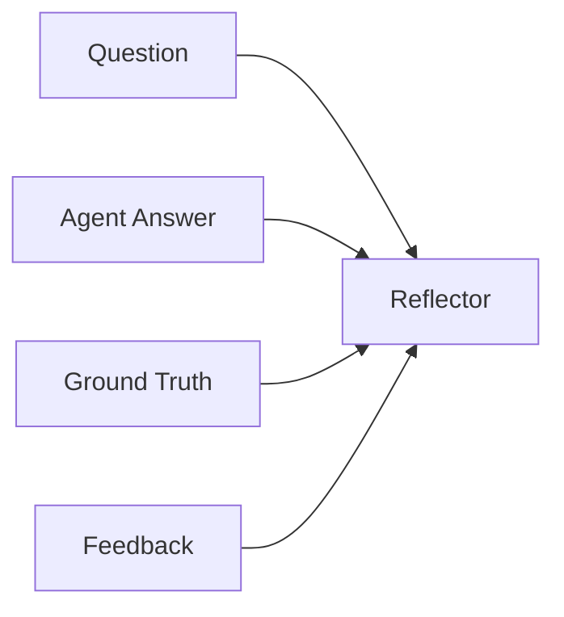
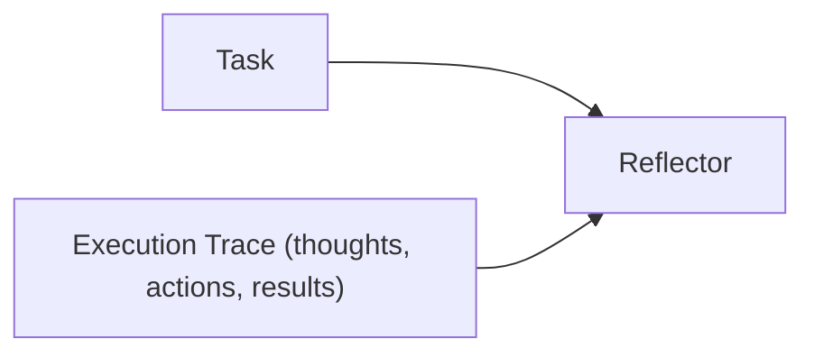

# Insight Levels

The ACE framework operates at three insight levels depending on what scope the Reflector analyzes.

## Overview

| Level | Reflector Scope | Feedback Source | Implementation |
|-------|-----------------|----------------|----------------|
| **Micro** | Single interaction | Environment (ground truth) | `ACE` runner with `TaskEnvironment` |
| **Meso** | Full agent run | Execution trace (no ground truth) | Integration runners (`BrowserUse`, `LangChain`, `ClaudeCode`) |
| **Macro** | Cross-run analysis | Pattern comparison across runs | Future enhancement |

## Micro-Level

The Reflector receives the agent's output **and** environment feedback (ground truth, correctness). This is the most precise learning signal.



Use when you have labeled data or a reliable evaluation function.

```python
from ace_next import ACE, Sample, SimpleEnvironment

runner = ACE.from_roles(
    agent=agent,
    reflector=reflector,
    skill_manager=skill_manager,
    environment=SimpleEnvironment(),
)

samples = [
    Sample(question="What is 2+2?", context="", ground_truth="4"),
]
runner.run(samples, epochs=3)
```

## Meso-Level

The Reflector receives the full **execution trace** — the agent's reasoning steps, tool calls, actions, and outcomes — but no external ground truth. It learns from execution patterns rather than correctness evaluation.



Use when wrapping external agents where you don't have labeled answers.

```python
from ace_next import BrowserUse

# The browser-use agent produces a rich trace of actions
runner = BrowserUse.from_model(
    browser_llm=ChatOpenAI(model="gpt-4o"),
    ace_model="gpt-4o-mini",
)
runner.run("Find the top post on Hacker News")
```

The extracted trace includes:

- Agent reasoning at each step
- Browser actions (click, type, navigate)
- Page observations
- Success/failure of each action

## Macro-Level

Cross-run pattern analysis — comparing strategies across multiple execution histories. Not yet implemented.

## What to Read Next

- [Three Roles](roles.md) — the roles involved at each level
- [Integration Pattern](../guides/integration.md) — meso-level integrations in practice
- [Full Pipeline Guide](../guides/full-pipeline.md) — micro-level pipelines in practice
