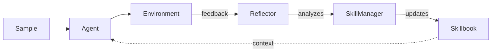
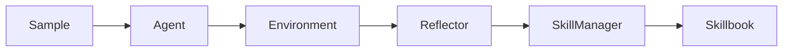
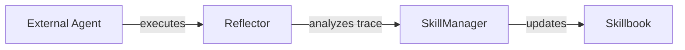

# How ACE Works

**Agentic Context Engineering (ACE)** enables AI agents to learn from their own execution feedback. Instead of updating model weights (expensive, slow, opaque), ACE evolves a **skillbook** of strategies based on what actually works.

!!! info "Research"
    ACE was introduced in [*Agentic Context Engineering: Evolving Contexts for Self-Improving Language Models*](https://arxiv.org/abs/2510.04618) by researchers at Stanford University and SambaNova Systems.

## The Learning Loop

Three collaborative roles share the same base LLM:



1. The **Agent** executes a task using strategies from the skillbook
2. The **Environment** evaluates the result (correct/incorrect, feedback)
3. The **Reflector** analyzes what worked and what failed
4. The **SkillManager** updates the skillbook with new strategies

The **Skillbook** accumulates strategies across runs, making every subsequent agent call smarter.

## Three Roles

| Role | Responsibility | Key Class |
|------|---------------|-----------|
| **Agent** | Executes tasks using skillbook strategies | `Agent` |
| **Reflector** | Analyzes execution results (what worked, what failed) | `Reflector` |
| **SkillManager** | Transforms reflections into skillbook updates | `SkillManager` |

All three roles use the same LLM — the intelligence comes from the specialized prompts each role receives.

See [Three Roles](roles.md) for details on each role's inputs and outputs.

## Two Architecture Patterns

### Full ACE Pipeline

Use when building a new agent from scratch.



All three roles participate. The Agent produces answers, the Environment evaluates them, and the learning pipeline updates the skillbook.

```python
from ace_next import ACE, Agent, Reflector, SkillManager, LiteLLMClient, SimpleEnvironment

llm = LiteLLMClient(model="gpt-4o-mini")
runner = ACE.from_roles(
    agent=Agent(llm),
    reflector=Reflector(llm),
    skill_manager=SkillManager(llm),
    environment=SimpleEnvironment(),
)
results = runner.run(samples, epochs=3)
```

### Integration Pattern

Use when wrapping an existing agent (browser-use, LangChain, Claude Code).



No ACE Agent — the external framework handles execution. ACE only learns from the results.

Three steps: **INJECT** skillbook context, **EXECUTE** with external agent, **LEARN** from results.

```python
from ace_next import BrowserUse

runner = BrowserUse.from_model(
    browser_llm=ChatOpenAI(model="gpt-4o"),
    ace_model="gpt-4o-mini",
)
results = runner.run("Find the top post on Hacker News")
```

See [Integration Pattern](../guides/integration.md) for building custom integrations.

## How It Compares

| Approach | Updates | Speed | Interpretability |
|----------|---------|-------|-----------------|
| **Fine-tuning** | Model weights | Slow (hours) | Low (opaque) |
| **RAG** | External documents | Medium | Medium |
| **ACE** | Skillbook context | Fast (real-time) | High (readable strategies) |

ACE strategies are human-readable, auditable, and transferable between models.

## Performance

| Benchmark | Improvement | Notes |
|-----------|-------------|-------|
| AppWorld Agent | **+17.1 pp** | Complex multi-step tasks with tool use |
| FiNER (Finance) | **+8.6 pp** | Financial reasoning tasks |
| Adaptation Latency | **-86.9%** | vs. existing context-adaptation methods |

## What to Read Next

- [The Skillbook](skillbook.md) — how strategies are stored and evolve
- [Three Roles](roles.md) — Agent, Reflector, and SkillManager in detail
- [Quick Start](../getting-started/quick-start.md) — run your first agent
