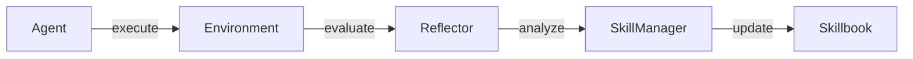

# Three Roles

ACE uses three collaborative roles that share the same base LLM. Each role has a specialized prompt that focuses it on a specific part of the learning loop.



## Agent

**Produces answers** using the current skillbook.

The Agent receives a question, context, and the skillbook's strategies, then generates a reasoned answer citing which skills it used.

```python
from ace_next import Agent, LiteLLMClient

llm = LiteLLMClient(model="gpt-4o-mini")
agent = Agent(llm)

output = agent.generate(
    question="What is 2+2?",
    context="Show your work",
    skillbook=skillbook,
    reflection=None,  # Optional: reflection from a previous attempt
)
```

### AgentOutput

| Field | Type | Description |
|-------|------|-------------|
| `final_answer` | `str` | The generated answer |
| `reasoning` | `str` | Step-by-step reasoning |
| `skill_ids` | `List[str]` | Skillbook strategies cited |
| `raw` | `Dict` | Raw LLM response |

## Reflector

**Analyzes execution outcomes** — what worked, what failed, and why.

The Reflector receives the agent's output, the environment's feedback, and the skillbook. It produces an analysis of the outcome and tags each cited skill as helpful, harmful, or neutral.

```python
from ace_next import Reflector

reflector = Reflector(llm)

reflection = reflector.reflect(
    question="What is 2+2?",
    agent_output=output,
    skillbook=skillbook,
    ground_truth="4",
    feedback="Correct!",
)
```

### ReflectorOutput

| Field | Type | Description |
|-------|------|-------------|
| `reasoning` | `str` | Analysis of the outcome |
| `error_identification` | `str` | What went wrong (if anything) |
| `root_cause_analysis` | `str` | Why it went wrong |
| `correct_approach` | `str` | What should have been done |
| `key_insight` | `str` | Main lesson learned |
| `skill_tags` | `List[SkillTag]` | `(skill_id, tag)` pairs |

### Reflector Modes

| Mode | Description |
|------|-------------|
| `SIMPLE` | Single-pass analysis (default) |
| `RECURSIVE` | Multi-pass with code execution in a REPL loop |

## SkillManager

**Transforms reflections into skillbook updates.**

The SkillManager takes the Reflector's analysis and decides which operations to apply to the skillbook — adding new strategies, updating existing ones, or removing harmful ones.

```python
from ace_next import SkillManager

skill_manager = SkillManager(llm)

sm_output = skill_manager.update_skills(
    reflection=reflection,
    skillbook=skillbook,
    question_context="Math problems",
    progress="3/5 correct",
)

# Apply the updates
skillbook.apply_update(sm_output.update)
```

### SkillManagerOutput

| Field | Type | Description |
|-------|------|-------------|
| `update` | `UpdateBatch` | Batch of update operations to apply |
| `consolidation_ops` | `List` | Deduplication operations (if enabled) |

## Shared LLM

All three roles share the same LLM instance. The intelligence comes from the specialized prompts, not from using different models:

```python
from ace_next import Agent, Reflector, SkillManager, LiteLLMClient

llm = LiteLLMClient(model="gpt-4o-mini")

agent = Agent(llm)              # Same LLM
reflector = Reflector(llm)      # Same LLM
skill_manager = SkillManager(llm)  # Same LLM
```

You can optionally use a cheaper model for the learning roles (Reflector + SkillManager) while keeping a stronger model for the Agent:

```python
agent_llm = LiteLLMClient(model="gpt-4o")
learning_llm = LiteLLMClient(model="gpt-4o-mini")

agent = Agent(agent_llm)
reflector = Reflector(learning_llm)
skill_manager = SkillManager(learning_llm)
```

## What to Read Next

- [Insight Levels](insight-levels.md) — micro, meso, and macro analysis scopes
- [Update Operations](updates.md) — the operations the SkillManager emits
- [Full Pipeline Guide](../guides/full-pipeline.md) — wire the roles together
