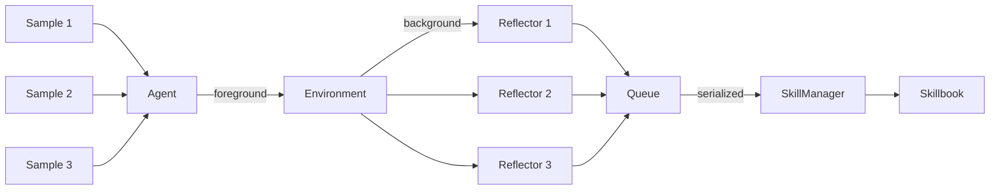

# Async Learning

By default, learning (Reflect, Tag, Update, Apply) runs synchronously after each sample. With async learning, the Agent returns immediately while learning continues in the background.

## Architecture



- **Reflectors** run concurrently (safe — they only read the skillbook)
- **SkillManager** runs sequentially (required — it writes to the skillbook)
- The Agent uses whatever skillbook state is available (eventual consistency)

## Basic Usage

Pass `wait=False` to `run()`:

```python
from ace_next import ACE

runner = ACE.from_roles(
    agent=agent,
    reflector=reflector,
    skill_manager=skill_manager,
    environment=environment,
)

# Agent returns fast — learning continues in background
results = runner.run(samples, epochs=3, wait=False)

# Use results immediately
for r in results:
    print(r)

# Wait before saving
runner.wait_for_background()
runner.save("learned.json")
```

## Monitoring Progress

```python
stats = runner.learning_stats
# {'active': 5, 'completed': 25}
```

## With ACELiteLLM

```python
from ace_next import ACELiteLLM, Sample, SimpleEnvironment

agent = ACELiteLLM.from_model("gpt-4o-mini")

samples = [Sample(question="...", context="", ground_truth="...")]
results = agent.learn(samples, environment=SimpleEnvironment(), wait=False)

# Agent is immediately available
answer = agent.ask("New question")

# Wait when you need to save
agent.wait_for_background()
agent.save("learned.json")
```

## Why This Architecture

| Component | Parallelizable? | Reason |
|-----------|----------------|--------|
| Reflector | Yes | Only reads the skillbook, produces independent analysis |
| SkillManager | No | Writes to the skillbook, handles deduplication |

This gives ~3x faster learning when the Reflector LLM calls run concurrently.

## What to Read Next

- [Full Pipeline Guide](full-pipeline.md) — synchronous pipeline setup
- [Testing](testing.md) — test async learning with MagicMock
