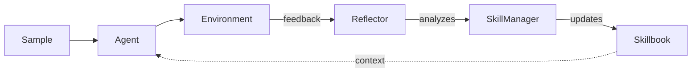

# ACE Framework

**Agentic Context Engineering** — a framework for self-improving language model agents.

ACE enables AI agents to learn from their own execution feedback through three collaborative roles: **Agent**, **Reflector**, and **SkillManager**. Learned strategies accumulate in a **Skillbook** that makes every subsequent call smarter.

## The Learning Loop



Each pass through the loop discovers new strategies, reinforces what works, and prunes what doesn't.

## Get Started in 30 Seconds

```python
from ace_next import ACELiteLLM

agent = ACELiteLLM.from_model("gpt-4o-mini")

answer = agent.ask("If all cats are animals, is Felix (a cat) an animal?")

agent.save("learned.json")
```

## Install

```bash
pip install ace-framework
```

## Quick Links

<div class="grid cards" markdown>

-   **Getting Started**

    ---

    Install the framework and run your first self-improving agent.

    [:octicons-arrow-right-24: Installation](getting-started/installation.md)
    [:octicons-arrow-right-24: Quick Start](getting-started/quick-start.md)

-   **Concepts**

    ---

    Understand the Skillbook, Roles, Insight Levels, and Update Operations.

    [:octicons-arrow-right-24: Overview](concepts/overview.md)

-   **Guides**

    ---

    Build full pipelines, integrate with existing agents, tune prompts.

    [:octicons-arrow-right-24: Full Pipeline](guides/full-pipeline.md)
    [:octicons-arrow-right-24: Integration Guide](guides/integration.md)

-   **Integrations**

    ---

    Ready-made runners for LiteLLM, LangChain, browser-use, and Claude Code.

    [:octicons-arrow-right-24: Integrations Overview](integrations/index.md)

</div>

## Available Runners

| Runner | Framework | Use Case |
|--------|-----------|----------|
| [`ACELiteLLM`](integrations/litellm.md) | LiteLLM (100+ providers) | Simple self-improving agent |
| [`LangChain`](integrations/langchain.md) | LangChain Runnables | Wrap chains/agents with learning |
| [`BrowserUse`](integrations/browser-use.md) | browser-use | Browser automation with learning |
| [`ClaudeCode`](integrations/claude-code.md) | Claude Code CLI | Coding tasks with learning |
| [`ACE`](guides/full-pipeline.md) | Full pipeline | Agent + Reflector + SkillManager |

## Paper

This framework implements the method from:

> *Agentic Context Engineering: Evolving Contexts for Self-Improving Language Models*
> [arXiv:2510.04618](https://arxiv.org/abs/2510.04618)
