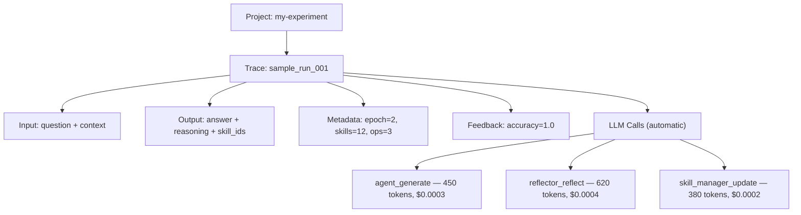

# Opik Observability

ACE integrates with [Opik](https://github.com/comet-ml/opik) for tracing, cost tracking, and performance monitoring. Opik is added as an explicit pipeline step — append `OpikStep` to any pipeline to log traces automatically.

## Installation

```bash
pip install ace-framework[observability]
```

## Quick Start

```python
from ace_next import (
    ACE, OpikStep,
    Agent, Reflector, SkillManager, Skillbook,
    LiteLLMClient, SimpleEnvironment,
)

# Option 1: Add OpikStep to an ACE runner
client = LiteLLMClient(model="gpt-4o-mini")

runner = ACE.from_roles(
    agent=Agent(client),
    reflector=Reflector(client),
    skill_manager=SkillManager(client),
    environment=SimpleEnvironment(),
)
runner.pipeline.then(OpikStep(project_name="my-experiment"))
```

```python
# Option 2: LLM-level cost tracking only (no pipeline traces)
from ace_next import register_opik_litellm_callback

registered = register_opik_litellm_callback(project_name="my-experiment")
```

## Starting the Opik Server

=== "Local (Docker)"

    ```bash
    docker run -d -p 5173:5173 --name opik ghcr.io/comet-ml/opik:latest

    # View traces at http://localhost:5173
    ```

=== "Comet Cloud"

    ```bash
    export COMET_API_KEY="your-api-key"
    # Traces appear at https://www.comet.com/opik
    ```

## OpikStep

`OpikStep` is a terminal side-effect step that logs one Opik trace per sample. It reads context fields but never mutates them — safe to append to any pipeline.

### Parameters

| Parameter | Type | Default | Description |
|-----------|------|---------|-------------|
| `project_name` | `str` | `"ace-framework"` | Opik project for organizing traces |
| `tags` | `list[str]` | `None` | Extra tags attached to every trace |
| `register_litellm_callback` | `bool` | `True` | Also register per-LLM-call cost tracking |

### What Gets Logged

Each trace includes:

| Field | Source |
|-------|--------|
| **Input** | Question and context from the sample |
| **Output** | Answer, reasoning, and skill IDs from `AgentOutput` |
| **Metadata** | Epoch, step index, skill count, reflection insights, operation counts |
| **Feedback scores** | Accuracy extracted from environment feedback (correct / incorrect) |

### Trace Hierarchy



## LLM Cost Tracking

When `register_litellm_callback=True` (the default), `OpikStep` registers an `OpikLogger` callback on LiteLLM. Every LLM call is automatically tracked with:

- Input / output tokens
- Model used
- Cost per call
- Latency

You can also register the callback independently:

```python
from ace_next import register_opik_litellm_callback

success = register_opik_litellm_callback(project_name="cost-tracking")
# Returns True if registered, False if Opik unavailable
```

This is useful when you want cost tracking without pipeline-level traces (e.g. with `ACELiteLLM`).

## Environment Variables

| Variable | Description | Default |
|----------|-------------|---------|
| `OPIK_PROJECT_NAME` | Project name for organizing traces | `ace-framework` |
| `OPIK_DISABLED=true` | Disable all Opik tracing | Not set |
| `OPIK_ENABLED=false` | Alternative way to disable tracing | Not set |
| `OPIK_URL_OVERRIDE` | Custom Opik server URL | `http://localhost:5173/api` |
| `OPIK_WORKSPACE` | Opik workspace name | `default` |

## Graceful Degradation

`OpikStep` soft-imports Opik. If the package is not installed or tracing is disabled via environment variables, the step silently becomes a no-op — no errors, no traces, no performance impact.

```python
from ace_next import OPIK_AVAILABLE

if OPIK_AVAILABLE:
    print("Opik tracing is available")
```

## Disabling Tracing

```bash
# In CI or tests
OPIK_DISABLED=true pytest tests/

# Or via the alternative variable
OPIK_ENABLED=false python my_script.py
```

## Full Example

```python
from ace_next import (
    ACE, Agent, Reflector, SkillManager, Skillbook,
    LiteLLMClient, SimpleEnvironment, Sample, OpikStep,
)

client = LiteLLMClient(model="gpt-4o-mini")
skillbook = Skillbook()

runner = ACE.from_roles(
    agent=Agent(client),
    reflector=Reflector(client),
    skill_manager=SkillManager(client),
    environment=SimpleEnvironment(),
    skillbook=skillbook,
)

# Add OpikStep to the runner's pipeline
runner.pipeline.then(OpikStep(project_name="ace-training"))

samples = [
    Sample(question="What is 2+2?", context="", ground_truth="4"),
    Sample(question="Capital of France?", context="", ground_truth="Paris"),
]

results = runner.run(samples, epochs=3)
runner.save("trained.json")

# View traces at http://localhost:5173 → project "ace-training"
```

## What to Read Next

- [Integration Pattern](../guides/integration.md) — how runners compose pipeline steps
- [Full Pipeline Guide](../guides/full-pipeline.md) — building pipelines from scratch
- [Async Learning](../guides/async-learning.md) — background learning with cost monitoring
